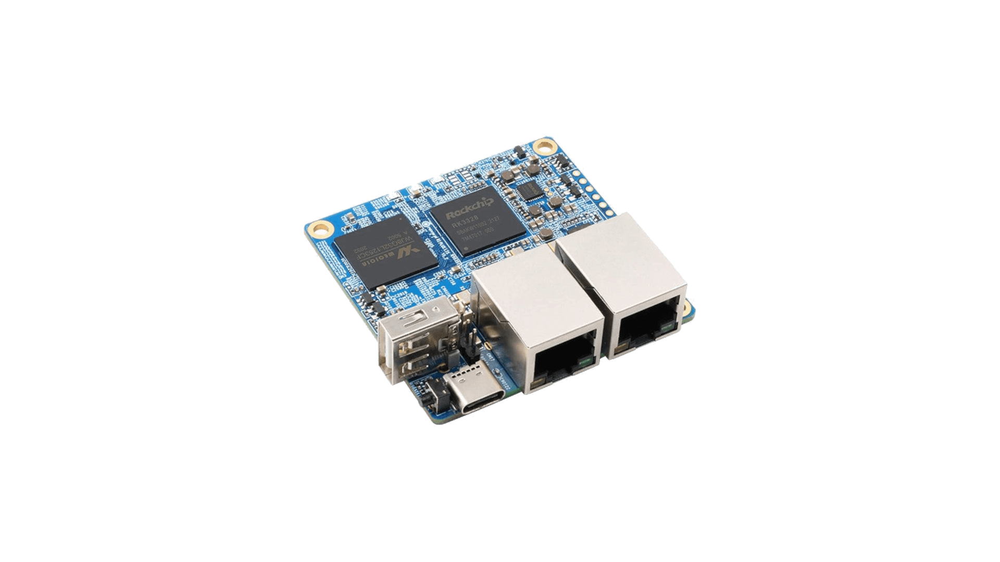
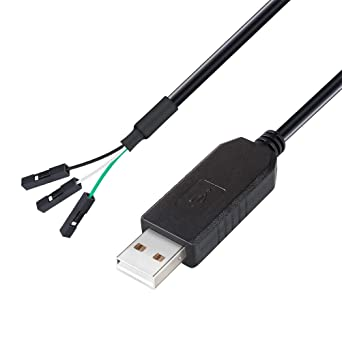
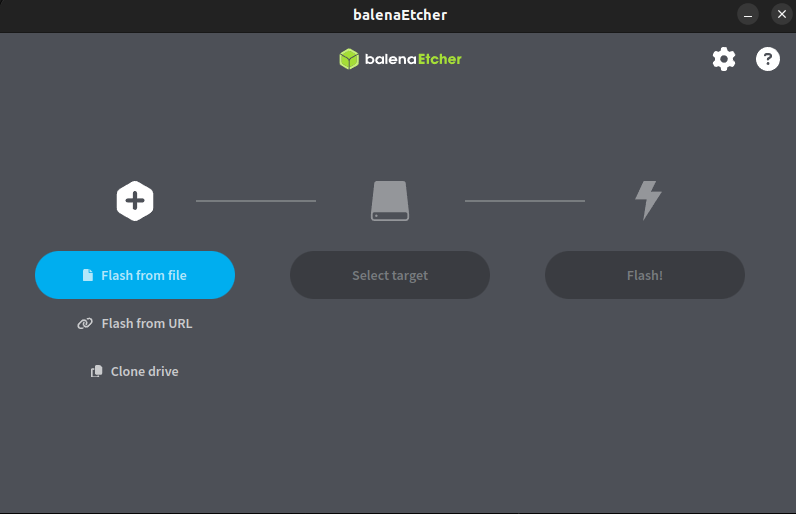

# Linux Yocto OS For Orange Pi R1+

This codebase is used to generate a full OS image for Orangepi R1+ boards, with support
for Docker and K3S (Kubernetes).

It is maintained by independent developers and aims at providing an easy-to-use Linux distribution 
for Orange Pi R1+ boards that can be used for something else than a router.

## What is the Orange Pi R1+ ??

First of all, here is the documentation about this board: [Orange Pi R1+ LTS](http://www.orangepi.org/html/hardWare/computerAndMicrocontrollers/details/orange-pi-R1-Plus-LTS.html)  


`What is the initial objective of this dev kit?`: This kit is meant to be a small router, using OpenWRT.  

`Why was this dev kit chosen?`: because it does not cost much (about 50$ at the time of writing this), and provides interesting performances. Here are the main specs:
- Quad-core Cortex-A53 64-Bit CPU  
- Mali-450MP2 GPU, for tablet-grade graphics  
- 1 GB LPDDR3 Memory  
- 13pin headers for GPIOs, I2C, audio and display!  
- USB-C powered  
- Dual Gigabit Ethernet Ports  

In summary, it has everything we need to make it a valid replacement for a Raspberry Pi!  

## Quick Start Guide

Follow these steps to get up and running with your Orangepi R1+!  

### Hardware you should have with you

1. An Orange Pi R1+ \[LTS\] (of course!)    
      
2. A USB-C cable or charger for powering up the device  
3. A Micro SD card, with a capacity of 16GB or higher  
4. A USB-A to Micro-SD adapter  
5. [Optional] A UART to USB Adapter that can reach communication speeds of 1500000bds, such as "DTECH 6ft 3.3V FTDI USB to TTL Serial"  
      

### Software to install on your computer

1. [Balena Etcher](https://www.balena.io/etcher)

### Preparing the SD Card

1. Download the latest `wic.gz` file from [the release section of this github repository](https://github.com/aledemers/yocto-orangepi-r1plus/releases)  
2. Insert the SD card in the USB-A to Micro-SD adapter
3. Connect your USB-A to Micro-SD adapter to your computer
4. Start the [Balena Etcher](https://www.balena.io/etcher) program. You should see a window similar to this one:



5. Click on the `Flash from file` button. Select the `wic.gz` file downloaded previously
6. Click on the `Select Target` button. Select your USB-A to Micro-SD adapter from the list
7. Click on `Flash!`
8. Wait for the process to complete
9. You can now remove the USB-A to Micro-SD adapter from your computer, and remove the Micro-SD card from it.

Your Micro-SD Card is now ready to launch!  

### Booting the board

1. Insert the Micro-SD card previously programmed in your `Orange Pi R1+` board  
2. Power it on using the USB-C Cable or a charger
3. After a few seconds, the dev kit's green LED should light solid ON, and the redlight should do periodic quick double flashes

    > :warning: If LEDs do not behave as expected, there is probably an issue! Try formatting the SD card ad run [preparing the SD card steps](#preparing-the-sd-card) again

4. You can now connect a network cable to one of the Ethernet port, and watch the network status lights flash!  
5. You can connect to the Orange Pi board using SSH, after finding its IP address (use your router's web page to find the IP):  

```shell
$ ssh root@IP_ADDRESS
passwd: root
```

### Use your dev kit!

#### Customizing your device

The whole filesystem is writable, so you can customize your device as you wish. Note that there is no configured package manager (like apt-get), as we did not bring up any yet.
If you want to install more software than what is on your device, either use [docker](https://www.docker.com/), or compile it from sources. You have compilers available, and even git :)  

#### Updating your device to a newer version of BlinkOS

This is as easy as: repeat the installation steps from [Preparing the SD Card](#Preparing the SD Card)! All data stored in `/home/root`, `/data` and 
`/var/lib/docker` will be kept throughout updates, but all the rest is going to be wiped off.

Be careful to store your precious projects in one of these locations!

## Advanced Users Tips

### Fast Preparation the SD Card Using a Linux Command Line

This section is for advanced Linux systems users who prefers to use the terminal instead of a graphical display,
and that finds Etcher too slow! The following procedure will save you a lot of time flashing the SD card of your
device.

#### Software requirements

- A computer with a Linux distribution installed
- bmaptool

#### Steps

In a nutshell, you can flash the `wic.gz` alongside the `wic.bmap` files available in
[the release section of this github repository](https://github.com/aledemers/yocto-orangepi-r1plus/releases)
using the followig set of commands. Pay attention to comments in the snippet:

```shell
$ BMAP_FILE=blinkos-base-image-orangepi-r1plus-lts.wic.bmap
$ THE_WIC_GZ_FILE=blinkos-base-image-orangepi-r1plus-lts.wic.gz
$ SD_CARD_PATH=/dev/sdX       # Replace sdX by the previously found label (sdb in the example)

$ sudo umount "${SD_CARD_PATH}"/*
$ sudo bmaptool copy --bmap "${THE_BMAP_FILE}" "${THE_WIC_GZ_FILE}" "${SD_CARD_PATH}"
```

## Developers Documentation

This part of the documentation is for advanced users that would like to compile the Linux image themselves  

## Requirements

- Docker  
- bmaptool  
- git  

## Setup

```shell
$ git clone https://github.com/aledemers/yocto-orangepi-r1plus.git
$ git submodule update --init
$ ./shell.sh
```

## Build Docker Image For Orange Pi R1+

```shell
$ MACHINE=orangepi-r1plus-lts bitbake blinkos-base-image
```

## Flashing the SD card

1. Find the output SD Card image:  
    ```
    build/tmp/deploy/images/orangepi-r1plus/IMAGE_NAME.wic.gz  
    ```
2. Insert the SD card to be programmed in your computer.  
3. Flash the image. In the command below:
    - Replace sdX by your SD card identifier (e.g.: sdb):  
    - Replace IMAGE_NAME by the name of the file found in the previous step  
    ```shell
    $ sudo bmaptool copy --bmap build/tmp/deploy/images/orangepi-r1plus/IMAGE_NAME.wic.bmap build/tmp/deploy/images/orangepi-r1plus/IMAGE_NAME.wic.gz /dev/sdX  
    ```
4. Remove the SD card from your computer, insert it in your orangepi-r1+, and watch it boot!  
5. UART console access will be provided on the 3-pins header beside the USB connector, baudrate=1500000 (see user orangepi r1+ user manual for more information about debug UART header)  
